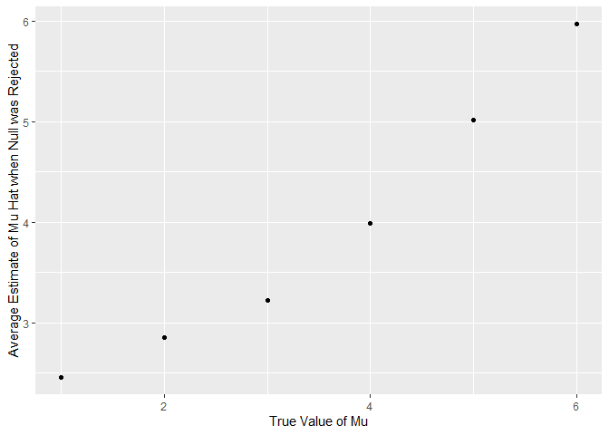

p8105_hw5_dmb2257
================
Diane Benites
2025-11-05

``` r
library(tidyverse)
```

    ## ── Attaching core tidyverse packages ──────────────────────── tidyverse 2.0.0 ──
    ## ✔ dplyr     1.1.4     ✔ readr     2.1.5
    ## ✔ forcats   1.0.0     ✔ stringr   1.5.2
    ## ✔ ggplot2   3.5.2     ✔ tibble    3.3.0
    ## ✔ lubridate 1.9.4     ✔ tidyr     1.3.1
    ## ✔ purrr     1.1.0     
    ## ── Conflicts ────────────────────────────────────────── tidyverse_conflicts() ──
    ## ✖ dplyr::filter() masks stats::filter()
    ## ✖ dplyr::lag()    masks stats::lag()
    ## ℹ Use the conflicted package (<http://conflicted.r-lib.org/>) to force all conflicts to become errors

``` r
library(rvest)
```

    ## 
    ## Attaching package: 'rvest'
    ## 
    ## The following object is masked from 'package:readr':
    ## 
    ##     guess_encoding

``` r
set.seed(1)
```

# Problem 1

This chunk includes a function that randomly draws birthdays for each
person in a fixed group of size “n_room”. This function also checks
whether there are duplicate birthdays in the group and returns TRUE or
FALSE based on the result.

``` r
bday_sim = function(n_room) {
  birthdays = sample(1:365, n_room, replace = TRUE)
  repeated_bday = length(unique(birthdays)) < n_room
  repeated_bday
}

bday_sim(20)
```

    ## [1] FALSE

This code chunk runs the previous function 10000 times for each group
size between 2 and 50. It then computes the probability that at least 2
people in the group will share a birthday by averaging the simulation
runs.

``` r
bday_sim_results = 
  expand_grid(
    bdays = 2:50,
    iter = 1:10000
  ) |>
  mutate(
    result = map_lgl(bdays, bday_sim)
  )|>
  group_by(
    bdays
  )  |>
  summarize(
    prob_repeat = mean(result)
  )
```

This code chunk plots probability as a function of group size.These
results show that as the number of people in each group increases, the
probability that at least two people in the group have the same birthday
also increases.

``` r
bday_sim_results |>
  ggplot(aes(x = bdays, y= prob_repeat)) +
  geom_point() +
  geom_line() +
  labs( 
    title = "Probability as a Function of Group Size",
    x = "Group Size",
    y = "Probability of Repeated Birthday")
```

<!-- -->

# Problem 2

NOTE TO SELF: FOR THE MOST PART THE CODING FOR THIS QUESTION IS DONE.
MAYBE JUST CLEAN AXIS TITLES AND SUCH AND DELETE UNNECESSARY CODE. MUST
STILL ANSWER WRITTEN QUESTIONS AND INTERPRETATION BUT YAYYYYY DID THE
CODE. ALSO DO NOT FORGET TO CHANGE FROM 50 TO 5000 DATASETS!!!!!

This code chunk sets the design elements n= 30 and sigma = 5.

``` r
sim_mu_hat = function(mu, n = 30, sigma = 5) {
  
  sim_data = 
    tibble(
      x = rnorm(mean = mu, n, sd = sigma)
    )
    sim_data |>
    summarize(
      mu_hat = mean(x))
    
    t.test(sim_data, mu = 0, alpha = 0)|>
      broom::tidy()|>
      mutate(
        mu_hat = estimate
      ) |>
      select(mu_hat, p.value)

}
```

This generates 50 datasets from the given model when mu = 0.

``` r
output_mu_zero = 
  rerun(50, sim_mu_hat(mu = 0)) |>
  bind_rows()
```

    ## Warning: `rerun()` was deprecated in purrr 1.0.0.
    ## ℹ Please use `map()` instead.
    ##   # Previously
    ##   rerun(50, sim_mu_hat(mu = 0))
    ## 
    ##   # Now
    ##   map(1:50, ~ sim_mu_hat(mu = 0))
    ## This warning is displayed once every 8 hours.
    ## Call `lifecycle::last_lifecycle_warnings()` to see where this warning was
    ## generated.

This code chunk creates a list for the different values of mu.

``` r
mu_list = 
  list(
    "mu = 1" = 1,
    "mu = 2" = 2,
    "mu = 3" = 3,
    "mu = 4" = 4,
    "mu = 5" = 5,
    "mu = 6" = 6
  )
```

OFFICE HOURS QUESTION: I ran this as i was reviewing lecture notes, but
i believe it does the same as the code chunk below… can i just delete
this?

``` r
output = vector("list", length = 6)

for(i in 1:6) {
  
  output [[i]] = 
    rerun(50, sim_mu_hat(mu = mu_list[[i]])) %>%
    bind_rows()
}
```

    ## Warning: `rerun()` was deprecated in purrr 1.0.0.
    ## ℹ Please use `map()` instead.
    ##   # Previously
    ##   rerun(50, sim_mu_hat(mu = mu_list[[i]]))
    ## 
    ##   # Now
    ##   map(1:50, ~ sim_mu_hat(mu = mu_list[[i]]))
    ## This warning is displayed once every 8 hours.
    ## Call `lifecycle::last_lifecycle_warnings()` to see where this warning was
    ## generated.

This creates a dataframe with the values of mu_hat for each value of mu.

``` r
sim_results =
  tibble(
    mu = c(1, 2, 3, 4, 5, 6)
    ) %>%
      mutate(
        output_lists = map(.x = mu, ~rerun(50, sim_mu_hat(.x))),
        estimate_df = map(output_lists, bind_rows)
    )%>%
    select(-output_lists)%>%
    unnest(estimate_df)
```

    ## Warning: There was 1 warning in `mutate()`.
    ## ℹ In argument: `output_lists = map(.x = mu, ~rerun(50, sim_mu_hat(.x)))`.
    ## Caused by warning:
    ## ! `rerun()` was deprecated in purrr 1.0.0.
    ## ℹ Please use `map()` instead.
    ##   # Previously
    ##   rerun(50, sim_mu_hat(.x))
    ## 
    ##   # Now
    ##   map(1:50, ~ sim_mu_hat(.x))

This code chunk calculates the power of the test.

``` r
sim_proportion_df =
sim_results |>
  mutate(
    rejected_status = 
      case_when(
        p.value<0.05 ~ "rejected",
        p.value>0.05 ~ "fail to reject"))
```

This code chunk shows the proportion of times the null was rejected
(power of the test) on the y axis and the true value of mu on the x
axis. As the true value of mu increases, the power of the test also
increases, until mu =4, then the power plateus at y =1.

``` r
sim_proportion_df |>
  group_by(mu, rejected_status)|>
  summarize(
    n= n()
  )|>
  pivot_wider(
    names_from = rejected_status,
    values_from = n
  )|>
  mutate(
    power = rejected / 50
  )|>
  
ggplot(
    aes(x = mu, y = power)) +
    geom_point() +
    labs(
      x = "True Value of Mu",
      y = "Power of the Test"
    )
```

    ## `summarise()` has grouped output by 'mu'. You can override using the `.groups`
    ## argument.

<!-- -->

This plot shows the average estimates of mu_hat on the y axis and the
true value of mu on the x axis. Based on the results of this graph, the
estimates of mu hat are proportional to the true value of mu.

``` r
sim_results |>
  group_by(mu)|>
  summarize(
    mean_mu_hat = mean(mu_hat)
  )|>
  ggplot(
    aes(x = mu, y = mean_mu_hat)) +
    geom_point() +
    labs(
      x = "True Value of Mu",
      y = "Average Estimate of Mu Hat"
    )
```

<!-- -->

This plot shows the average estimate of mu_hat (only in samples for
which the null was rejected) on the y axis and the true value of mu on
the x axis.

``` r
sim_proportion_df |>
  filter(str_detect(rejected_status, "rejected"))|>
  group_by(mu)|>
  summarize(
    rejected_mean_mu_hat = mean(mu_hat)
  )|>
  ggplot(
    aes(x = mu, y = rejected_mean_mu_hat)) +
    geom_point() +
    labs(
      x = "True Value of Mu",
      y = "Average Estimate of Mu Hat when Null was Rejected"
    )
```

<!-- -->

# Problem 3

NOTE FOR OFFICE HOURS: Noticed issue with original dataset-\> there is a
datapoint that has the city/state listed as tulsa, AL. I just filtered
it out, is that okay? Mention the issue with tulsa and how it was
addressed.

This code chunk imports the raw data. This data includes information on
homicides in 50 large U.S. cities. The raw data set includes 52179
observations of 12 variables. This code chunk cleans the names in the
dataset. It also unites the city and state columns, and removes
inconsistent data for city_state.

``` r
homicide_df = 
  read_csv("homicide-data.csv")|>
  janitor::clean_names()|>
  unite("city_state", city, state, sep = ", ")|>
  mutate(
    city_state = fct_infreq(city_state)
  )|>
  filter(!(city_state == "Tulsa, AL"))
```

    ## Rows: 52179 Columns: 12
    ## ── Column specification ────────────────────────────────────────────────────────
    ## Delimiter: ","
    ## chr (9): uid, victim_last, victim_first, victim_race, victim_age, victim_sex...
    ## dbl (3): reported_date, lat, lon
    ## 
    ## ℹ Use `spec()` to retrieve the full column specification for this data.
    ## ℹ Specify the column types or set `show_col_types = FALSE` to quiet this message.

This code chunk creates a dataframe, called city_df, that groups the
data by city and computes the total number of homicides in each city. It
also creates a dataframe, called unsolved_df, that filters the data to
only include unsolved homicides and computes the number of unsolved
homicides in each city. The dataframe, called city_homicides_df, is also
created, which joins the 2 previous data frames. The city_homicides_df
includes three columns, city_state, total homicides, and unsolved
homicides.

``` r
total_city_df <- homicide_df |>
  group_by(city_state) |>
  summarize(
    total_homicides = n())

unsolved_city_df <- homicide_df |>
  filter(str_detect(disposition, "[Closed without arrest] [Open/No arrest]"))|>
  group_by(city_state)|>
  summarize(
    unsolved_homicides = n())

city_homicides_df =
  left_join(total_city_df, unsolved_city_df, by = "city_state")
```

``` r
baltimore_df =
  city_homicides_df|>
  filter(city_state == "Baltimore, MD")

prop.test(baltimore_df |>
        pull(unsolved_homicides), 
               baltimore_df |>
          pull(total_homicides))|>
  broom::tidy()|>
  mutate(estimated_proportion = estimate)|>
  select(estimated_proportion, conf.low, conf.high)|>
  unite("confidence_interval", conf.low, conf.high, sep = ", ")
```

    ## # A tibble: 1 × 2
    ##   estimated_proportion confidence_interval                 
    ##                  <dbl> <chr>                               
    ## 1                0.646 0.627562457662644, 0.663159860401662
