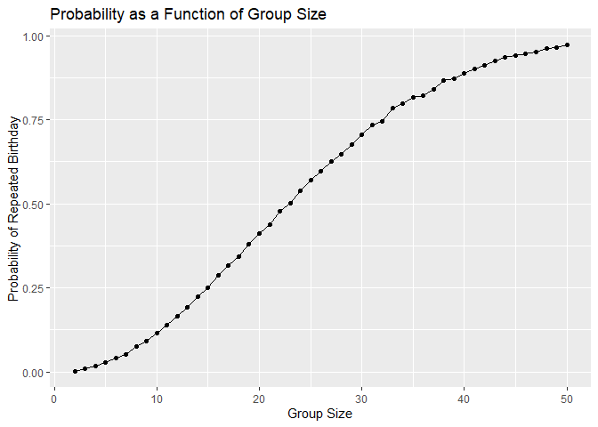
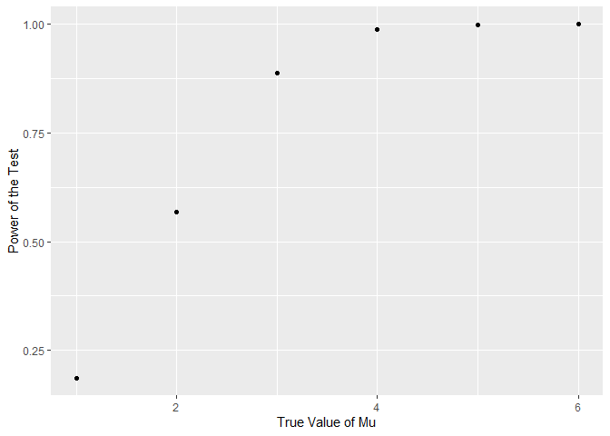
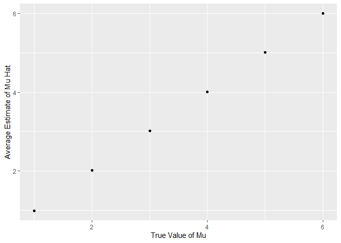
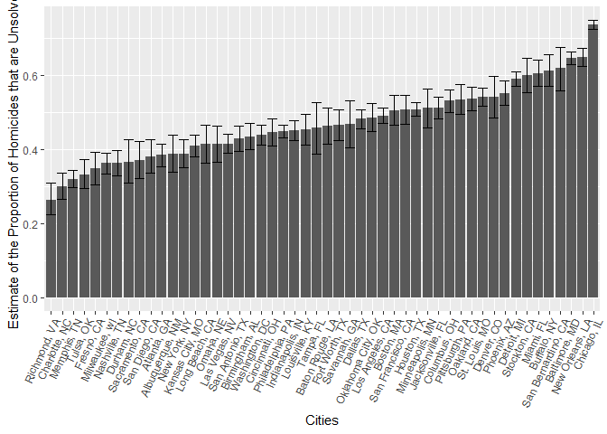

p8105_hw5_dmb2257
================
Diane Benites
2025-11-05

``` r
library(tidyverse)
```

    ## ── Attaching core tidyverse packages ──────────────────────── tidyverse 2.0.0 ──
    ## ✔ dplyr     1.1.4     ✔ readr     2.1.5
    ## ✔ forcats   1.0.0     ✔ stringr   1.5.2
    ## ✔ ggplot2   3.5.2     ✔ tibble    3.3.0
    ## ✔ lubridate 1.9.4     ✔ tidyr     1.3.1
    ## ✔ purrr     1.1.0     
    ## ── Conflicts ────────────────────────────────────────── tidyverse_conflicts() ──
    ## ✖ dplyr::filter() masks stats::filter()
    ## ✖ dplyr::lag()    masks stats::lag()
    ## ℹ Use the conflicted package (<http://conflicted.r-lib.org/>) to force all conflicts to become errors

``` r
library(rvest)
```

    ## 
    ## Attaching package: 'rvest'
    ## 
    ## The following object is masked from 'package:readr':
    ## 
    ##     guess_encoding

``` r
set.seed(1)
```

# Problem 1

This chunk includes a function that randomly draws birthdays for each
person in a fixed group of size “n_room”. This function also checks
whether there are duplicate birthdays in the group and returns TRUE or
FALSE based on the result.

``` r
bday_sim = function(n_room) {
  birthdays = sample(1:365, n_room, replace = TRUE)
  repeated_bday = length(unique(birthdays)) < n_room
  repeated_bday
}
```

This code chunk runs the previous function 10000 times for each group
size between 2 and 50. It then computes the probability that at least 2
people in the group will share a birthday by averaging the simulation
runs.

``` r
bday_sim_results = 
  expand_grid(
    bdays = 2:50,
    iter = 1:10000
  ) |>
  mutate(
    result = map_lgl(bdays, bday_sim)
  )|>
  group_by(
    bdays
  )  |>
  summarize(
    prob_repeat = mean(result)
  )
```

This code chunk plots probability of a repeated birthday as a function
of group size.These results show that as the number of people in each
group increases, the probability that at least two people in the group
have the same birthday also increases.

``` r
bday_sim_results |>
  ggplot(aes(x = bdays, y= prob_repeat)) +
  geom_point() +
  geom_line() +
  labs( 
    title = "Probability as a Function of Group Size",
    x = "Group Size",
    y = "Probability of Repeated Birthday")
```

<!-- -->

# Problem 2

This code chunk sets the design elements n= 30 and sigma = 5. I created
the function that will generate datasets from the model x~Normal\[µ,
σ\]. This function saves mu_hat estimate and p-value from the test of H:
mu = 0 and alpha = 0.05.

``` r
sim_mu_hat = function(mu, n = 30, sigma = 5) {
  
  sim_data = 
    tibble(
      x = rnorm(mean = mu, n, sd = sigma)
    )

    sim_data |>
    summarize(
      mu_hat = mean(x))
    
    t.test(sim_data, mu = 0, alpha = 0.05)|>
      broom::tidy()|>
      mutate(
        mu_hat = estimate
      ) |>
      select(mu_hat, p.value)

}
```

This generates 5000 datasets from the given model when mu = 0.

``` r
output_mu_zero = 
  rerun(5, sim_mu_hat(mu = 0)) |>
  bind_rows()
```

    ## Warning: `rerun()` was deprecated in purrr 1.0.0.
    ## ℹ Please use `map()` instead.
    ##   # Previously
    ##   rerun(5, sim_mu_hat(mu = 0))
    ## 
    ##   # Now
    ##   map(1:5, ~ sim_mu_hat(mu = 0))
    ## This warning is displayed once every 8 hours.
    ## Call `lifecycle::last_lifecycle_warnings()` to see where this warning was
    ## generated.

This code chunk creates a list for the different values of mu.

``` r
mu_list = 
  list(
    "mu = 1" = 1,
    "mu = 2" = 2,
    "mu = 3" = 3,
    "mu = 4" = 4,
    "mu = 5" = 5,
    "mu = 6" = 6
  )
```

This creates a dataframe with the values of mu_hat for each value of mu.

``` r
sim_results =
  tibble(
    mu = c(1, 2, 3, 4, 5, 6)
    ) %>%
      mutate(
        output_lists = map(.x = mu, ~rerun(5, sim_mu_hat(.x))),
        estimate_df = map(output_lists, bind_rows)
    )%>%
    select(-output_lists)%>%
    unnest(estimate_df)
```

    ## Warning: There was 1 warning in `mutate()`.
    ## ℹ In argument: `output_lists = map(.x = mu, ~rerun(5, sim_mu_hat(.x)))`.
    ## Caused by warning:
    ## ! `rerun()` was deprecated in purrr 1.0.0.
    ## ℹ Please use `map()` instead.
    ##   # Previously
    ##   rerun(5, sim_mu_hat(.x))
    ## 
    ##   # Now
    ##   map(1:5, ~ sim_mu_hat(.x))

This code chunk creates a variable “rejected_status” that identifies
whether the null is rejected or failed to be rejected for each dataset.

``` r
sim_proportion_df =
sim_results |>
  mutate(
    rejected_status = 
      case_when(
        p.value<0.05 ~ "rejected",
        p.value>0.05 ~ "fail to reject"))
```

This code chunk summarizes the number of times the null was rejected and
failed to be rejected. It then computes the power of the test by taking
the proportion of times the null was rejected.

This plot shows the power of the test on the y axis and the true value
of mu on the x axis. There is a strong association between effect size
and power. As the true value of mu increases, the power of the test also
increases. The change in the power of the test becomes more gradual as
the true value of mu increases.

``` r
sim_proportion_df |>
  group_by(mu, rejected_status)|>
  summarize(
    n= n()
  )|>
  pivot_wider(
    names_from = rejected_status,
    values_from = n
  )|>
  mutate(
    power = rejected / 5
  )|>
  
ggplot(
    aes(x = mu, y = power)) +
    geom_point() +
    labs(
      x = "True Value of Mu",
      y = "Power of the Test"
    )
```

    ## `summarise()` has grouped output by 'mu'. You can override using the `.groups`
    ## argument.

<!-- -->

This plot shows the average estimates of mu_hat on the y axis and the
true value of mu on the x axis.

``` r
sim_results |>
  group_by(mu)|>
  summarize(
    mean_mu_hat = mean(mu_hat)
  )|>
  ggplot(
    aes(x = mu, y = mean_mu_hat)) +
    geom_point() +
    labs(
      x = "True Value of Mu",
      y = "Average Estimate of Mu Hat"
    )
```

<!-- -->

This plot shows the average estimate of mu_hat (only in samples for
which the null was rejected) on the y axis and the true value of mu on
the x axis. Yes, the sample average of mu hat across tests for which the
null is rejected is approximately equal to the true value of mu. This is
because as the true value of mu increases, there is a greater proportion
of times in which the null was rejected. As the power of the test
approaches one, the greater the similarity between the average estimate
of mu_hat and the average estimate of mu_hat when the null is rejected.

``` r
sim_proportion_df |>
  filter(str_detect(rejected_status, "rejected"))|>
  group_by(mu)|>
  summarize(
    rejected_mean_mu_hat = mean(mu_hat)
  )|>
  ggplot(
    aes(x = mu, y = rejected_mean_mu_hat)) +
    geom_point() +
    labs(
      x = "True Value of Mu",
      y = "Average Estimate of Mu Hat when Null was Rejected"
    )
```

<!-- -->

# Problem 3

This code chunk imports the raw data. This data includes information on
homicides in 50 large U.S. cities. The raw data set includes 52179
observations of 12 variables. Upon reviewing the dataset, it was found
that there was one observation that incorrectly listed Tusla in the
state of Alabama. Since this is incorrect, this data point was filtered
out of the dataset. This code chunk cleans the names in the dataset. It
also unites the city and state columns, and removes inconsistent data
for city_state.

``` r
homicide_df = 
  read_csv("homicide-data.csv")|>
  janitor::clean_names()|>
  unite("city_state", city, state, sep = ", ")|>
  mutate(
    city_state = fct_infreq(city_state)
  )|>
  filter(!(city_state == "Tulsa, AL"))
```

    ## Rows: 52179 Columns: 12
    ## ── Column specification ────────────────────────────────────────────────────────
    ## Delimiter: ","
    ## chr (9): uid, victim_last, victim_first, victim_race, victim_age, victim_sex...
    ## dbl (3): reported_date, lat, lon
    ## 
    ## ℹ Use `spec()` to retrieve the full column specification for this data.
    ## ℹ Specify the column types or set `show_col_types = FALSE` to quiet this message.

This code chunk creates a dataframe, called city_df, that summarizes the
total number of homicides in each city. It also creates a dataframe,
called unsolved_df, that summarizes the number of unsolved homicides in
each city. The dataframe, city_homicides_df, is also created, which
joins the 2 previous data frames. The city_homicides_df contains the
total number of homicides and the number of unsolved homicides in each
city.

``` r
total_city_df = 
  homicide_df |>
  group_by(city_state) |>
  summarize(
    total_homicides = n())

unsolved_city_df = 
  homicide_df |>
  filter(str_detect(disposition, "[Closed without arrest] [Open/No arrest]"))|>
  group_by(city_state)|>
  summarize(
    unsolved_homicides = n())

city_homicides_df =
  left_join(total_city_df, unsolved_city_df, by = "city_state")
```

For the city of Baltimore, MD, use the prop.test function to estimate
the proportion of homicides that are unsolved; save the output of
prop.test as an R object, apply the broom::tidy to this object and pull
the estimated proportion and confidence intervals from the resulting
tidy dataframe.

QUESTION: For this do I have to use the pull function or is select
okay??

In this code chunk, a dataframe was created that only pertains to
Baltimore, MD. Prop.test and broom::tidy were used to create a tidy
dataframe of the estimate of proportion of homicides that are unsolved
and the confidence interval.

``` r
baltimore_df =
  city_homicides_df|>
  filter(city_state == "Baltimore, MD")

output_baltimore =
  prop.test(baltimore_df |>
        pull(unsolved_homicides), 
               baltimore_df |>
          pull(total_homicides))|>
  broom::tidy()|>
      select(estimate, conf.low, conf.high)
```

This code chunk nests the city_homicides_df by each city.This code chunk
also creates a function to apply the prop.test to each city data frame,
tidy the dataframe, and select only the estimate and confidence interval
for each city.

``` r
nested_df <-
  city_homicides_df|>
  group_by(city_state)%>%
  nest()

city_func <-
  function(df) {
    prop.test(df |>
                pull(unsolved_homicides),
              df|> 
                pull(total_homicides))|>
      broom::tidy()|>
      select(estimate, conf.low, conf.high)
  }
```

This code chunk creates a list column “listcol_estimates’ of the tibbles
for each city. Each tibble contains the estimate and confidence
intervals for one city. This code chunk then adds the list column to the
nested_df dataframe. The tidy dataframe was then created with the
unnested data and only includes the estimated proportions and confidence
intervals for each city.

``` r
listcol_estimates <- 
  map(nested_df$data, city_func)

nested_df =
  nested_df %>%
  mutate(list_estimates = map(data, city_func))

tidy_df =
  nested_df|>
  unnest(data, list_estimates)|>
  select(city_state, estimate, conf.low, conf.high)
```

    ## Warning: `unnest()` has a new interface. See `?unnest` for details.
    ## ℹ Try `df %>% unnest(c(data, list_estimates))`, with `mutate()` if needed.

This code chunk creates a plot of the estimate of proportion of unsolved
homicides for each city. This plot also includes error bars based on the
upper and lower limits of the confidence intervals. The cities are
organized by the proportion of unsolved homicides.

``` r
tidy_df |>
  ggplot(
    aes(fct_reorder(city_state, estimate), estimate)) +
    geom_col() +
    geom_errorbar(aes(ymin = conf.low, ymax = conf.high)) +
    labs(
      x = "Cities",
      y = "Estimate of the Proportion of Homicides that are Unsolved"
    ) +
  theme(axis.text.x = element_text(angle = 65, hjust = 1))
```

<!-- -->
